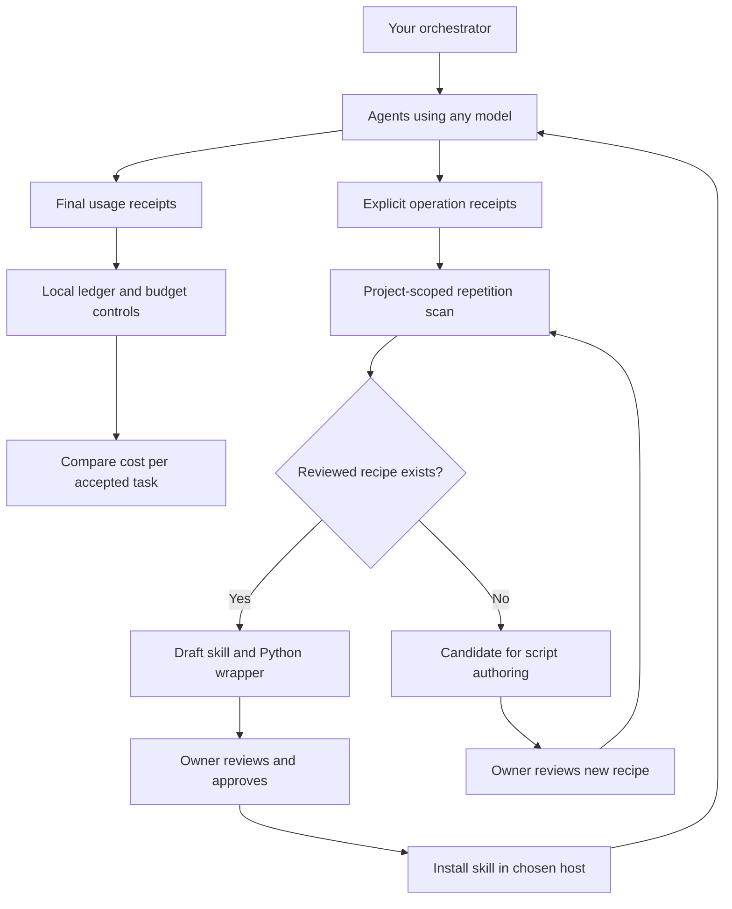
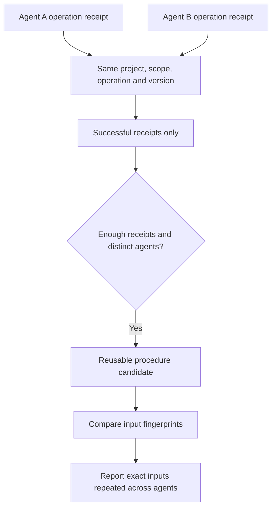
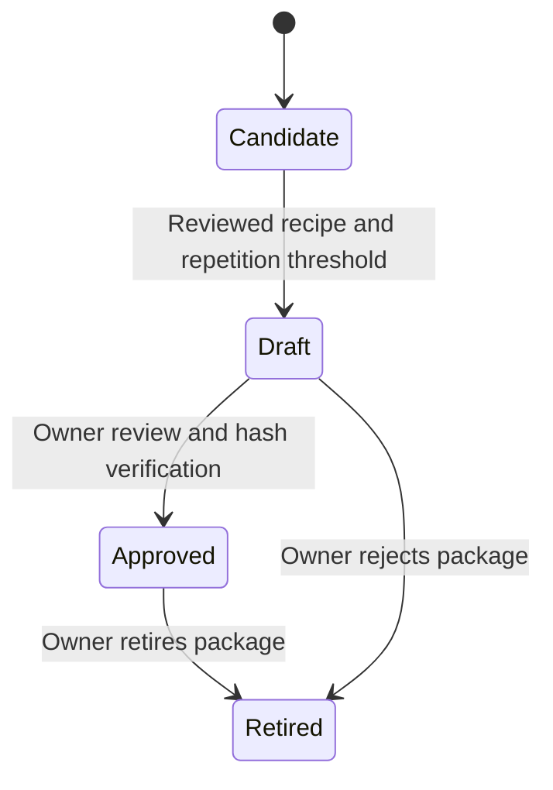

# AgentBrake

**A deterministic efficiency layer for agentic workflows: measure usage, spot repeated work across agents, and turn recurring procedures into reusable scripts and skills.**

Formerly **Token Police**. The repository, Python package, plugin IDs, and `token-police` command retain their names for compatibility. `agentbrake` is the new CLI alias.

AgentBrake does not call an LLM, pick a model, or take over your agents. Your orchestrator owns the work. AgentBrake provides local accounting, bounded controls, and reusable procedures using Python 3.10+ and SQLite, with no runtime dependencies.

**Status: v0.4 — local implementation, ready for demonstration; live multi-host effectiveness and billing savings still require a pilot.** No provider key is needed for the demo.

## The entire workflow



1. Register task/project identity and collect final usage receipts. Missing cost stays unknown; model/provider labels are data, not a routing policy.
2. Each participating runner records completed operations with stable agent and event IDs, an operation/version, input fingerprint, scope, status, and evidence reference.
3. Scan the shared local ledger. By default, three successful operations across at least two distinct agents produce a reuse candidate. A repeated receipt is counted once.
4. Generate small skill packages automatically for reviewed recipes. Pure deterministic work should invoke the underlying command directly; the skill helps an agent discover when to use it.
5. Review the draft, approve its recorded hashes, and install it through the host's normal mechanism. Approval does not itself install or grant permissions.
6. Continue measuring real outcomes and costs. A smaller output or a repeated operation is not proof of monetary savings.

## Try it locally

From this checkout:

```bash
python -m pip install --no-deps .
agentbrake --help
python scripts/demo.py
python scripts/demo_reuse.py
```

The first demo exercises existing accounting and controls. The second records synthetic activity from two agents, identifies repeated work, and creates an inspectable skill package in a temporary directory. Neither contacts a model.

For real work, use an explicit home shared by cooperating processes on the **same machine**:

```bash
agentbrake --home /absolute/path/to/team-state activity-record examples/activity.json
agentbrake --home /absolute/path/to/team-state reuse-scan --project demo --scope client-a
agentbrake --home /absolute/path/to/team-state reuse-draft --project demo --scope client-a
```

One receipt alone does not trigger a draft. Have each runner emit its own truthful receipt with a unique event ID. Call `reuse-draft` after recording completion, or on an orchestrator-controlled schedule, to create skills as work accumulates. There is no background model or scheduler inside AgentBrake.

## What counts as repeated work?



Procedure repetition and identical-input repetition are reported separately. Input fingerprints should cover the input revision, relevant parameters, and environment contract. Evidence is an opaque reference, not a prompt or file body. Success is reported by the runner, not independently proven by AgentBrake.

Matching is exact and deterministic. Different labels for the same task will not match; use a shared operation vocabulary. There is no semantic inference, embedding service, automatic result cache, in-flight deduplication, or permission bypass. Required checks still run against current inputs.

**Isolation:** use a different scope for each client/security boundary. Scope filters prevent accidental mixing in reports; they are not access control against someone who can read the SQLite file. Mutually untrusted clients need separate homes and OS identities. Multi-machine deployment requires a real shared service; do not put this SQLite database on a network filesystem and call it distributed coordination.

## Scripts first; skills when useful

The built-in version-1 recipe catalog currently supports:

| Operation | Script behavior |
|---|---|
| `secret-names` | Lists suspicious filenames without reading their values |
| `diffstat` | Returns capped changed paths and a short diff summary |
| `skill-budget` | Checks a skill document's word budget |

A draft contains `SKILL.md` and `scripts/run.py`. Generated code comes from reviewed templates, never captured commands or model output. Unknown operations remain `needs_reviewed_recipe`; the task-owning agent can author a deterministic implementation and submit a catalog change for review.



```bash
agentbrake --home /absolute/path/to/team-state reuse-state PACKAGE_ID --state approved
agentbrake --home /absolute/path/to/team-state reuse-state PACKAGE_ID --state retired
```

Drafts live under `reuse-drafts/PACKAGE_ID/` in that home. Copy an approved package into your chosen host's skill location only after review. Retirement records lifecycle state; remove any installed copies separately. See [the receipt and lifecycle contract](docs/reuse.md).

## Model and host independence

| Integration | Coverage |
|---|---|
| Any model, provider, or orchestrator | Canonical JSON receipts and CLI commands |
| OpenAI / Anthropic receipt formats | Optional normalization adapters; no SDK or model call |
| OpenTelemetry GenAI | Flattened attributed records accepted by the adapter; not an OTLP collector |
| Claude Code / Codex | Packaged host-specific hooks for supported local events |
| Other hosts / remote agents | Explicit CLI/receipt integration required; hooks do not intercept them |

Model-neutral does not mean every host has the same hooks. Existing hooks observe their own session activity; **cross-agent discovery uses the explicit activity receipt interface**, not private chat access. See [integration](docs/integration.md) and the [existing command/install guide](docs/legacy-guide.md).

## Existing controls remain available

- Idempotent usage ingestion, atomic budget reservations/settlement, and retry conflict detection.
- Observe-by-default hooks, bounded reads/output, task-aware reference caching, and explicit organization policy.
- Rule lifecycle, local audit chain, retention controls, monitoring health, and cost per accepted task comparisons.
- No inferred acceptance, fabricated billing data, forced model downgrade, or automatic paid supervisor loop.

A pre-dispatch budget is effective only when the runner honors admission decisions. Actual usage can exceed estimates. Local audit hashes help detect changes but are not tamper-proof against the machine owner.

## What we borrowed—and what we did not rebuild

[RTK](https://github.com/rtk-ai/rtk) demonstrates deterministic output reduction; [Token Economy Kit](https://github.com/dani-lore/token-economy-kit) uses targeted hooks and skills; [AgentBudget](https://github.com/AgentBudget/agentbudget) addresses application budgets; [Cycles](https://github.com/runcycles/cycles-claude-plugin) offers reservation-based tool governance. AgentBrake's distinctive focus is connecting explicit cross-agent repetition evidence to small, reviewed reusable procedures while retaining honest accounting.

Use those tools where they already solve the problem. AgentBrake does not recreate a universal command compressor, provider SDK proxy, distributed budget service, or model router. [Research notes and standards mapping](docs/research.md) explain the boundaries.

## Verification and limitations

Local regression and packaging checks are documented in [validation](docs/validation.md). This release does not claim live host certification, provider-wide interception, guaranteed savings, semantic duplicate detection, or automatic synthesis of arbitrary correct programs. Generated skills depend on the installed AgentBrake package; their hashes cover wrapper files, not that installation or the operating system. Pin your reviewed package version in deployment.

Activity records and reuse audit evidence currently have no automatic pruning; size and protect the local home accordingly. Operation labels, agent IDs, and evidence references must not contain secrets. See [security](SECURITY.md), [privacy](docs/privacy.md), [accounting](docs/accounting.md), and [operations](docs/operations.md).

MIT licensed.
